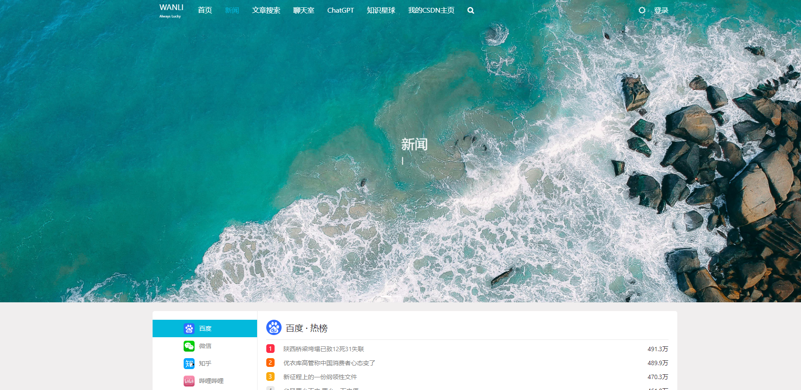
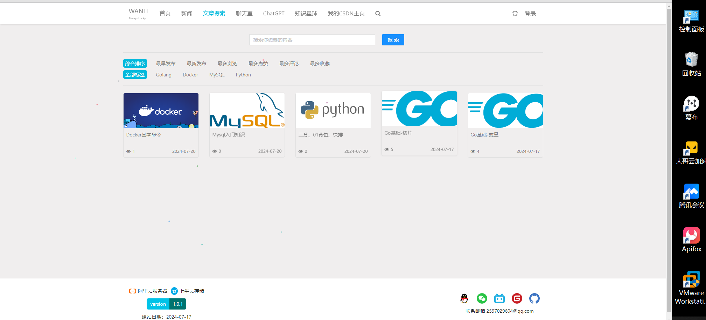
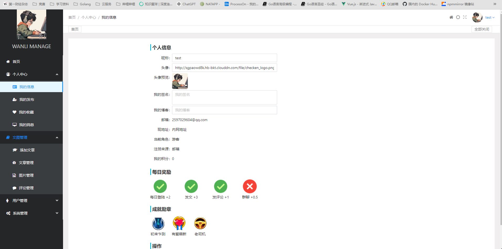

# WANLI 博客系统

## 项目介绍

基于vue3和gin框架开发的前后端分离个人博客系统，包含md格式的文本编辑展示，点赞评论收藏，新闻热点，匿名聊天室，文章搜索等功能。

---

## 功能展示


[B 站视频]()

图片展示：









---

## 技术介绍

#### 开发环境

| 开发工具        |功能描述			
|-------------|--|
| GoLand      |后端开发		
| Vscode      |前端开发			
| Apifox      |API测试			
| Ubuntu      |依赖软件运行
| xftp、xsheel |Linux 远程工具

| 开发环境                    | 版本     |
|-------------------------|--------|
| GoLang                  | 1.22.3 |
| nodejs                  | 20.14.0 |
| MySQL                   | 8.0    |
| Elasticsearch、kibana、ik | 7.10.1 |
| Redis                   | latest |

---

#### 技术栈

> 这里只写一些主流的通用技术，详细第三方库：前端参考 package.json 文件，后端参考 go.mod 文件

|功能描述|前端|官方地址|
|--|--|--|
|Vue3框架|vuejs|https://cn.vuejs.org/
|Vue组件|ant-design-vue|https://next.antdv.com/docs/vue/introduce-cn/
|Mark Down|md-editor-v3|https://imzbf.github.io/md-editor-v3/
|状态管理工具|pinia|https://pinia.vuejs.org/|
|构建工具|vite|https://cn.vitejs.dev/
|可视化图表库|echarts|https://echarts.apache.org/zh/index.html|

|功能描述|后端|官方地址|
|--|--|--|
|GO语言|golang|https://github.com/golang/go
|WEB框架|gin|https://gin-gonic.com/zh-cn/docs/
|API文档|swaggo|https://github.com/swaggo
|ORM 库|gorm|https://github.com/go-gorm/gorm
|日志库|logrus|https://github.com/sirupsen/logrus
---

## 本地运行

> 自行安装 Golang、Node、MySQL、Redis 、Elasticsearch 环境
> Golang 安装参考官方文档
> Node 建议安装使用 `https://nodejs.org/zh-cn` 的长期维护版
> MySQL、Redis、Elasticsearch 建议使用 Docker 运行

后端项目运行：

```powershell
# 1、启动MySQL、Redis、Elasticsearch,其中mysql需要新建一个库
# 2、修改项目运行的配置文件 settings.yaml

# 3、初始化运行环境
go mod tidy 				# 下载当前项目所依赖的包
go run main.go -db 			# mysql建表
go run main.go -es create	# elasticsearch建索引

# 4、mysql插入菜单表数据
INSERT INTO gvb.menu_models (id, created_at, updated_at, title, path, slogan, abstract, abstract_time, banner_time, sort) VALUES (1, NOW(), NOW(), '首页', '/', '众神眷恋的幻想乡', '天寒地冻路远马亡又何妨', 5, 5, 1);
INSERT INTO gvb.menu_models (id, created_at, updated_at, title, path, slogan, abstract, abstract_time, banner_time, sort) VALUES (2, NOW(), NOW(), '新闻', '/news', '新闻三分钟，知晓天下事', '震惊!男人看了会沉默，女人看了会流泪!不转不是中国人!',  5, 5, 2);
INSERT INTO gvb.menu_models (id, created_at, updated_at, title, path, slogan, abstract, abstract_time, banner_time, sort) VALUES (3, NOW(), NOW(), '文章搜索', '/search', '文章搜索', '文章搜索',  5, 5, 3);
INSERT INTO gvb.menu_models (id, created_at, updated_at, title, path, slogan, abstract, abstract_time, banner_time, sort) VALUES (4, NOW(), NOW(),'聊天室', '/chat_group', '聊天室', '聊天室',  5, 5, 4);

# 5、创建第一个用户，后续可在前端创建或注册
go run main.go -u admin		# 管理员
go run main.go -u user		# 普通用户

# 6、启动项目
go run main.go
```

前端项目运行：

```powershell
# 下载当前项目所依赖的包
npm insatll
# 启动项目
npm run dev
```

---

## 线上部署（Linux）| 阿里云服务器 | 七牛云存储

本项目线上部署目录结构如下，必需的目录及文件：

```bash
  gvb
    └─deploy
        └─gvb
            ├─elasticsearch
            │  ├─config
            │  ├─data
            │  └─plugins			
            │  	  └─ik    # 使用ik分词器，下载7.12.0版本，然后解压重命名为ik，上传到linux挂载的plugins目录下
            ├─gvb_server  # 服务端代码，这个不用容器启动 直接 ./main 启动即可
            │  ├─docs
            │  ├─uploads
            │  ├─main(二进制文件)
            │  └─settings.yml(配置文件)
            ├─gvb_web
            │  └─dist
            ├─mysql
            │  └─data
            ├─nginx
            │  ├─conf
            │  ├─html
            │  └─logs
            └─redis
                └─data
```

---

#### 安装Docker和docker-compose

> 只需要提前安装好docker运行环境，可自行上网搜索资料安装

安装地址：[https://developer.aliyun.com/article/708974

---

#### 依赖软件准备

> 后端Golang中的settings.yaml文件，请自行修改你的配置内容。
>
> 在服务器上使用docker-compose启动所有容器：mysql、redis、elasticsearch、kibana、nginx

docker-compose.yml 和 .env 文件放在部署服务器的 deploy 目录下，cd 到deploy启动docker-compose，以下是各个文件的内容。

**1、docker-compose.yml 文件**

```yaml
version: "3"

networks:
  gvb-network:
    driver: bridge
    ipam:
      config:
        - subnet: ${SUBNET}

services:
  gvb-redis:
    image: redis:7.0.8-alpine
    container_name: gvb-redis
    volumes:
      - ${GVB_DATA_DIRECTORY}/redis/data:/data
    ports:
      - ${REDIS_PORT}:6379 # 自定义的是暴露出去的端口, Redis 容器内运行固定为 6379
    command: redis-server --requirepass ${REDIS_PASSWORD} --appendonly yes
    networks:
      gvb-network:
        ipv4_address: ${REDIS_HOST}

  gvb-mysql:
    image: mysql:8.0
    container_name: gvb-mysql
    volumes:
      - ${GVB_DATA_DIRECTORY}/mysql/data:/var/lib/mysql
    environment:
      - MYSQL_ROOT_PASSWORD=${MYSQL_ROOT_PASSWORD} # root 账号的密码
      - MYSQL_DATABASE=${MYSQL_DATABASE} # 初始化的数据库
      - MYSQL_USER=${MYSQL_USER}
      - MYSQL_PASSWORD=${MYSQL_PASSWORD}
      - TZ=Asia/Shanghai
    command: --max_connections=1000
      --character-set-server=utf8mb4
      --collation-server=utf8mb4_general_ci
    ports:
      - ${MYSQL_PORT}:3306 # 自定义的是暴露出去的端口, MySQL 容器内运行固定为 3306
    networks:
      gvb-network:
        ipv4_address: ${MYSQL_HOST}

  gvb-elasticsearch:
    image: elasticsearch:7.12.0
    container_name: gvb-elasticsearch
    volumes:
      - ${GVB_DATA_DIRECTORY}/elasticsearch/data:/usr/share/elasticsearch/data
      - ${GVB_DATA_DIRECTORY}/elasticsearch/config/elasticsearch.yml:/usr/share/elasticsearch/config/elasticsearch.yml
      - ${GVB_DATA_DIRECTORY}/elasticsearch/plugins:/usr/share/elasticsearch/plugins
    environment:
      - discovery.type=single-node
      - ES_JAVA_OPTS=-Xms128m -Xmx256m
    ports:
      - ${ELASTICSEARCH_PORT01}:9200 # 自定义的是暴露出去的端口, elasticsearch 容器内运行固定为 9200和9300
      - ${ELASTICSEARCH_PORT02}:9300
    networks:
      gvb-network:
        ipv4_address: ${ELASTICSEARCH_HOST}
    command:
      [
        "/bin/sh",
        "-c",
        "chmod -R 777 /usr/share/elasticsearch/data /usr/share/elasticsearch/config /usr/share/elasticsearch/plugins && /usr/local/bin/docker-entrypoint.sh",
      ]

  gvb-nginx:
    image: nginx:latest
    container_name: gvb-nginx
    volumes:
      - ${GVB_DATA_DIRECTORY}/nginx/conf/nginx.conf:/etc/nginx/nginx.conf
      - ${GVB_DATA_DIRECTORY}/nginx/logs:/var/log/nginx
      - ${GVB_DATA_DIRECTORY}/gvb_web:/usr/share/nginx/html # 修改路径为 nginx 默认的 web 根目录
      - ${GVB_DATA_DIRECTORY}/gvb_server:/usr/share/nginx/server # 修改路径为 nginx 默认的服务器目录
    ports:
      - ${NGINX_PORT}:80 # 自定义的是暴露出去的端口, nginx 容器内运行固定为 80
    networks:
      gvb-network:
        ipv4_address: ${NGINX_HOST}

  gvb-kibana:
    image: kibana:7.12.0
    container_name: gvb-kibana
    environment:
      - ELASTICSEARCH_HOSTS=http://gvb-elasticsearch:9200
    ports:
      - ${KIBANA_PORT}:5601
    networks:
      gvb-network:
        ipv4_address: ${KIBANA_HOST}
```

**2、 .env 文件（相关参数自行修改）**

```bash
# https://docs.docker.com/compose/migrate/
# docker-compose.yml 同目录下的 .env 文件会被加载为其环境变量

# COMPOSE_PROJECT_NAME=gin-vue-blog

# 数据存储的文件夹位置 (默认在当前路径生成 gvb 文件夹)
GVB_DATA_DIRECTORY=./gvb

# Redis
REDIS_PORT=6379
REDIS_PASSWORD=password

# Kibana
KIBANA_PORT=5601

# MySQL
MYSQL_PORT=3306
MYSQL_ROOT_PASSWORD=password
MYSQL_DATABASE=gvb_db
MYSQL_USER=gvb
MYSQL_PASSWORD=password

# Elasticsearch
ELASTICSEARCH_PORT01=9200
ELASTICSEARCH_PORT02=9300

# Nginx
NGINX_PORT=80

# Docker Network (一般不需要变, 除非发生冲突)
SUBNET=172.12.0.0/24
REDIS_HOST=172.12.0.2
MYSQL_HOST=172.12.0.3
ELASTICSEARCH_HOST=172.12.0.4
KIBANA_HOST=172.12.0.5
NGINX_HOST=172.12.0.6
```

后端 settings.yml 配置文件，在目录：gvb\deploy\gvb\gvb_server 下。

```yaml
mysql:
  host: 你的服务器地址
  port: 3306
  config: charset=utf8mb4&parseTime=True&loc=Local
  db: gvb_db
  user: root
  password: xxx
  log_Level: ""
logger:
  level: info
  prefix: '[gvb]'
  director: log
  show-line: true
  log-in-console: true
system:
  host: 0.0.0.0
  port: 8080
  env: release
  ssl-pem: ""
  ssl-key: ""
site-info:
  created_at: "2024-07-17"
  bei_an: 等待中
  title: 万里的个人博客
  qq_image: /uploads/file/admin/qq_20240717101939.jpg
  version: 1.0.1
  email: 2597029604@qq.com
  wechat_image: /uploads/file/admin/wechat_20240717101945.jpg
  name: WANLI
  job: Golang后端开发
  addr: 北京
  slogan: 万里
  slogan_en: WANLI
  web: http://bloggo.chat/
  bilibili_url: https://space.bilibili.com/1829444123?spm_id_from=333.1007.0.0
  gitee_url: https://gitee.com/xiwanli
  github_url: https://github.com/xzhHas/ginblog-wanli
qq:
  app_id: 
  key: 
  redirect: http://127.0.0.1/login?flag=qq
qiniu:
  enable: true
  access_key: 
  secret_key: 
  bucket: gvbdb
  cdn: http://spaotwd8k.hb-bkt.clouddn.com/
  zone: z1
  prefix: gvb
  size: 150
email:
  host: smtp.qq.com
  port: 465
  user: xxx@qq.com
  password: 
  default-from-email: xxx@qq.com
  use_ssl: true
  user_tls: false
jwt:
  secret: 9Saj0XAf8SdTYHj3lq6EOnyIrSfC5D6D
  expires: 1
  issuer: xiwanli
upload:
  size: 150
  path: uploads/file/
redis:
  ip: 你的服务器地址
  port: 6379
  password: "xxx"
  pool_size: 100
es:
  host: http://你的服务器地址
  port: 9200
  user: ""
  password: ""
```

Elasticsearch 配置文件：elasticsearch.yml，在目录：gvb\deploy\gvb\elasticsearch\config 下。

```powershell
http.host: 0.0.0.0
```

nginx配置文件：nginx.conf，在目录：gvb\deploy\gvb\nginx\conf 下。

```powershell
user  root;
worker_processes  auto;

error_log  /var/log/nginx/error.log notice;
pid        /var/run/nginx.pid;

events {
    worker_connections  1024;
}

http {
    include       /etc/nginx/mime.types;
    default_type  application/octet-stream;

    log_format  main  '$remote_addr - $remote_user [$time_local] "$request" '
                      '$status $body_bytes_sent "$http_referer" '
                      '"$http_user_agent" "$http_x_forwarded_for"';

    access_log  /var/log/nginx/access.log  main;
    sendfile        on;
    tcp_nopush     on;

    client_max_body_size 8M; # 上传文件大小限制
    keepalive_timeout  65;

    server {
        listen 80; # HTTP
        server_name bloggo.chat www.bloggo.chat; # 域名

        # 前端请求处理
        location / {
            root   /usr/share/nginx/html/dist/;
            index  index.html index.htm;
            try_files $uri $uri/ /index.html;
        }

        # WebSocket 请求处理
        location /wsUrl/ {
            rewrite ^/wsUrl/(.*)$ /$1 break;   # 长连接时间
            proxy_pass http://你的服务器地址/api/;
            proxy_http_version 1.1;
            proxy_set_header Upgrade $http_upgrade;
            proxy_set_header Connection "Upgrade";
            proxy_redirect off;
            proxy_set_header Host $host;
            proxy_set_header X-Real-IP $remote_addr;
            proxy_set_header X-Forwarded-For $proxy_add_x_forwarded_for;
            proxy_set_header X-Forwarded-Host $server_name;
            proxy_read_timeout 3600s;  # 长连接时间
        }

        # API 请求处理
        location /api/ {
            proxy_set_header Host $host;
            proxy_set_header X-Real-IP $remote_addr;
            proxy_set_header X-Forwarded-For $proxy_add_x_forwarded_for;
            proxy_pass http://你的服务器地址/api/;
        }

        # 文件上传处理
        location /uploads/ {
            alias /usr/share/nginx/server/uploads/;
        }

        # Swagger 文档处理
        location /swagger/ {
            proxy_pass http://你的服务器地址/swagger/;
        }
    }
}
```

---

#### 应用程序准备

后端项目打包生成的main文件、docs文件夹、settings.yaml、uploads文件夹复制至部署服务器的 gvb_server 目录下。

```bash
# 生成api文档
swag init 

# 后端go打包（请使用cmd打包，不然打包后的文件还可能是windows的版本）
set GOARCH=amd64
set GOOS=linux
set CGO_ENABLED=0
go build -o main 
```

前端项目打包生成的dist文件夹及其文件复制至部署服务器的 gvb_web 目录下。

```bash
# 前端npm打包
npm run build
```

---

#### 启动应用

修改好各项配置

```bash
# docker compose 启动依赖软件
cd xxxxx/gvb/deploy/
docker compose up -d

#启动后端应用
cd xxxxx/gvb/gvb_server/
./main -es create (首先创建es的索引)
nohup ./main > main.log 2>&1 & （启动后端程序）

tail -f main.log  (访问日志)
```

访问应用

---

## 最后

万里code，二次开发开源项目。
